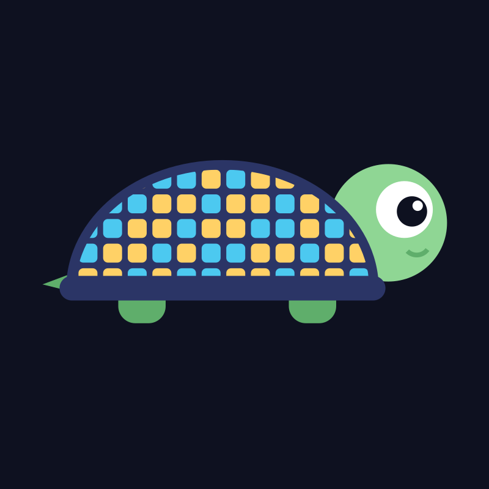

# めでたしかめ

YouTube ショート「めでたしかめ」の動画を作っているコードです。
**動画1本 ＝ `sims/` のファイル1つ。** 絵も音も、すべてこのコードが作っています（素材ファイルはありません）。



## 動かし方

```bash
pip install -r requirements.txt   # ほかに ffmpeg が必要
python sims/gacha-1pct-100.py      # out/gacha-1pct-100/ に mp4 ができる
python sims/gacha-1pct-100.py --stills   # 要所の静止画だけ
```

2026-09-28 以降の回はノートの見た目（`engine/note.py`）で、字は手書き風の [Klee One](https://fonts.google.com/specimen/Klee+One)（SIL Open Font License、`fonts/` に同梱）を使います。
Windows なら `fonts/KleeOne-SemiBold.ttf` をダブルクリックしてインストールしてください。それより前の回の字はメイリオです。

## 答えの確かめ方

- 各ファイルは、シミュレーションの結果と理論値（数式）を照合し、ずれていたら動画を書き出しません（`check_answers`）。
- 乱数の種は、最初に見せる「1人目」「1部屋目」の見本が分かりやすくなるように選んでいます。
  答えの数字は、全試行（1万回など）の結果から計算しています。

## 動画の一覧

| 公開日 | 問い | 動画 | コード |
|---|---|---|---|
| 2026-10-02 | 表なら1.5倍、裏なら0.6倍を100回。得する人は何%？ | [見る](https://youtube.com/shorts/dVRuGlVY6rI) | [`bai-100kai.py`](sims/bai-100kai.py) |
| 2026-10-01 | コイン10回。表がちょうど5回になる確率は？ | [見る](https://youtube.com/shorts/dOFlvkgn_54) | [`coin-10kai.py`](sims/coin-10kai.py) |
| 2026-09-30 | 床の線に針を1万本落とす。線に重なるのは何本？ | [見る](https://youtube.com/shorts/RZDpqANNIcc) | [`hari-10000.py`](sims/hari-10000.py) |
| 2026-09-29 | 30人で席替え。誰も元の席に戻らない確率は？ | [見る](https://youtube.com/shorts/QqUfB-rXhus) | [`sekigae-30nin.py`](sims/sekigae-30nin.py) |
| 2026-09-28 | 10人でじゃんけん。あいこが終わるまで平均何回？ | [見る](https://youtube.com/shorts/m7eN1UpaNM0) | [`janken-10nin.py`](sims/janken-10nin.py) |
| 2026-09-27 | 全5種のおまけ。全部そろうまで平均何個？ | [見る](https://youtube.com/shorts/MCiG9GtCLEk) | [`omake-5shu-comp.py`](sims/omake-5shu-comp.py) |
| 2026-09-26 | 1%のガチャを100回。当たる人は何%？ | [見る](https://youtube.com/shorts/W4140l0DFmw) | [`gacha-1pct-100.py`](sims/gacha-1pct-100.py) |

## ライセンス

MIT License。授業や勉強会で自由に使ってください。
